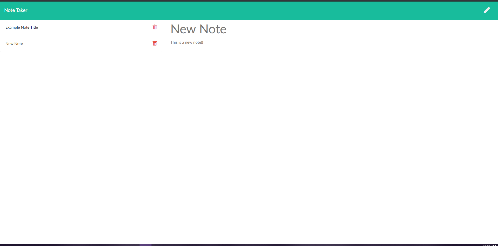

# Project Name  
 Note Taker

  ## Overview 
  An application that can be used to write, save, and delete notes. This application uses an express backend that saves and retrieves the notes from a JSON file. It's a simple to-do app to help you do what you need.. to-do!

  ## Table of Contents:
  - [Links](#Links)
  - [Screenshots_and_GIFs](#Screenshots_and_GIFs)
  - [Installation](#Installation)
  - [How_to_use](#How_to_use)
  - [Benefit](#Benefit)
  - [License](#License)
  - [Contribute](#Contribute)

 ## Links
  - ( https://camerong88.github.io/NoteTaker/)
  - (https://github.com/CameronG88/NoteTaker)
  - (https://serene-depths-54345.herokuapp.com/)

 ## Screenshots_and_GIFs 
 First vid shows this deployed with Herkou while screenshots show local host accessibility. 
  -  
  - 
  - 
  - 
  -      

  ## Installation 
   
  - Heroku
  - Npm Express
  - Node.js
  
  ## How_to_use
  This application can be used by navigating to (https://serene-depths-54345.herokuapp.com/) or by cloning this app from GitHub and using local host/ by running 'npm i' to install dependencies followed by 'npm start' in the terminal.

  To begin saving notes click the Get Started button on the home page. Write a title for the note where indicated towards the top of the page and the note text body in the space indicated below the title. To save youre note, click the save icon in the upper right corner of the page after a note has been created. To begin a new note click the pencil icon in the upper right corner. The sidebar holds your saved notes and to view them simply click on the title of the desired note or you can delete the note by clicking the trash can icon to the right of the note title.

  ## Benefit
  Anyone who needs to be more organized and wants a simply designed easy-to-use app for quick note-taking!

  ## License  
  
  MIT

  ## Credits
  John Dinsmore, Jorge Alvarez 

  ## Contribute
  Commit or comment to the project in github.

  © Copyright 2020
